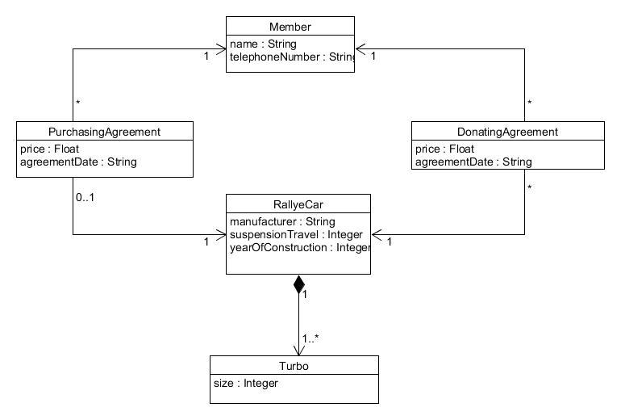

# ST1 Praktikum MS5 - Implementierung des logischen Datenmodells

### Testseite:
[Testpage für M5](http://students.pages.st.archi-lab.io/st1/ws22/m5/tests/ST1MS5_tests_group_11dbbc9e-6d30-49d6-856c-b56628ad6fe3)

### Deadline:
Deadline für M5: 12.01.23 23:59 Uhr

### Infos zu den Tests:
Auch dieses Mal sind **alle** Tests automatisiert :). Im Gegensatz zu den bisherigen Meilensteinen sind dieses 
Mal jedoch **alle** Tests remote - es gibt also lokal erst einmal keine Tests bei Ihnen. 

**Tipp:** Legen Sie sich mindestens einen eigenen Test lokal an, um Ihren Code zu prüfen - und wenn es nur dazu
gut ist, dass Sie prüfen, ob der Code compiliert. 
**Wenn Sie nicht compilierenden Code pushen, dann wird auch die Testseite nicht erzeugt!**

Dies sind die Tests, die remote (nur in der Build-Pipeline) ausgeführt werden:
* `E1RelationsTests` testet den Aufbau Ihrer Klassen und deren Beziehungen untereinander
* `E1CorrectValueObjectTest`testet, ob Sie das *richtige* Value Object umgesetzt haben
* `E1ValueObjectImplementationTest` testet, ob Sie dieses Value Object auch *korrekt umgesetzt* haben.

Sie sollten also zuerst schauen, dass Sie das richtige VO umgesetzt haben, bevor Sie weitermachen.

### ... und noch ein allgemeiner Hinweis

Die Fehlermeldungen der Tests sind ziemlich wenig "sprechend". Kontrollieren Sie im Fehlerfall bitte einmal 
alle Stellen, die für die Persistierung nötig sind (Annotation mit `@Entity` oder `@Embeddable`, korrekte
Multiplizitäten der Beziehungen, korrekte Spezifikation des Repos, etc.). 

Wenn Sie gar nicht mehr weiterkommen, dann fragen Sie uns (am besten in Discord an `@Staff-Softwaretechnik`). 
Das ist besser als blindlings Änderungen an den eigenen Klassen auszuprobieren. 

### Logisches Datenmodell

## Exercise 1) Implementieren des logischen Datenmodells mittels  Spring Data JPA

Setzen Sie das logische Datenmodell in Java-Code um, wobei Sie wie in den Vorlesungsvideos beschrieben Spring
Data JPA einsetzen, um Entities zu persistieren. 
* Implementieren Sie für alle Klassen des logischen Datenmodells die korrekt annotierten Java-Klassen.
* Ergänzen Sie Repositories, wo nötig.

Hier sind noch einige weitere technische Hinweise zur Umsetzung.

#### Datentypen
Bitte halten Sie sich **strikt** an die im LDM vorgegebenen Datentypen. 

#### Package Structure

Bitte beachten Sie folgende Konventionen bei der Struktur und Benamung der Packages:

* Alle Entities müssen in dem Package `thkoeln.st.st1praktikum.exercises.exercise1.entities` abgelegt sein. 
* Value Objects müssen in dem Package `thkoeln.st.st1praktikum.exercises.exercise1.entities` abgelegt sein. 
* Repositories müssen in dem Package `thkoeln.st.st1praktikum.exercises.exercise1.repositories` angelegt werden.

#### Ableitung von AbstractEntitiy

Alle Entities müssen von der Klasse `thkoeln.st.st1praktikum.core.AbstractEntitiy` abgeleitet werden, damit 
sie eine UUID als ID haben. 

#### Besondere Annahmen unserer Tests

1. **1:n-Beziehungen als `List<...>`**: Wenn in einem Entity oder Value Object eine Beziehung zu "n" anderen Objekten implementiert 
   ist, dann erwarten die Tests, dass dafür `List<...>` verwendet wird.
2. **public No-Args-Konstruktor**: Es muss einen `public` No-Args-Konstruktor geben (für Spring würde eigentlich
   `protected` reichen)
3. Die Tests gehen von Namenskonventionen für Beziehungen aus: Wenn z.B. die Klasse `Planet` eine 1:n-Beziehung
   zu `SpaceStation` hat, dann wird dafür eine (Listen-)Variable namens `spaceStations` erwartet. Analog bei einer
   "zu 1"-Beziehung - da fehlt dann das Plural-s. 

#### Repository

Nutzen Sie ausschließlich `org.springframework.data.repository.CrudRepository` für die Speicherung Ihrer Entitäten. 

